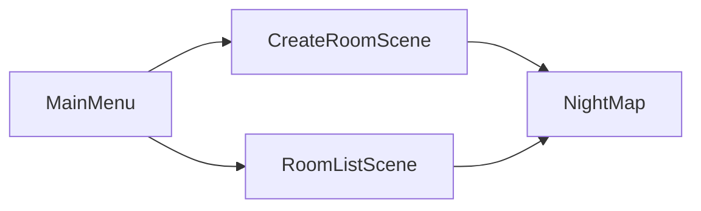

<!-- README styled with HTML + inline CSS (GitHub supports inline styles on most elements) -->

<div align="center">

# 🌙 MidnightChat

<p>
  <strong>Trò chuyện & khám phá đêm</strong> · Unity · Photon PUN · Voice & Chat · Multiplayer mobile
</p>

<p>
  
  
  
  
  
</p>

</div>

---

## 📖 Giới thiệu

**MidnightChat** là game 3D trên mobile — gặp gỡ, trò chuyện và khám phá map đêm **NightMap** cùng bạn bè. Đặt tên, tạo hoặc tham gia phòng multiplayer qua Photon, dùng **voice chat**, **chat phòng** và điều khiển joystick trên màn hình cảm ứng.

<table>
<tr>
<td width="50%" valign="top" style="padding: 16px; background: linear-gradient(135deg, #1a1a2e 0%, #16213e 100%); border-radius: 12px;">

### 🎮 Gameplay
- Di chuyển 3D với joystick
- Camera theo nhân vật
- Âm thanh bước chân (footstep)
- Map đêm với môi trường stylized

</td>
<td width="50%" valign="top" style="padding: 16px; background: linear-gradient(135deg, #1a1a2e 0%, #0f3460 100%); border-radius: 12px;">

### 🌐 Multiplayer
- Kết nối Photon tự động
- Tạo / tham gia phòng (tối đa 10 người)
- Danh sách phòng realtime
- Đồng bộ scene giữa các client

</td>
</tr>
<tr>
<td width="50%" valign="top" style="padding: 16px; background: linear-gradient(135deg, #16213e 0%, #1a1a2e 100%); border-radius: 12px;">

### 🎙️ Voice & Chat
- Voice chat qua Photon Voice
- Cài đặt âm lượng / mic trong game
- Chat text trong phòng

</td>
<td width="50%" valign="top" style="padding: 16px; background: linear-gradient(135deg, #0f3460 0%, #533483 100%); border-radius: 12px;">

### 📱 Mobile
- Adaptive Performance (Samsung / Google)
- UI tối ưu cảm ứng
- Hướng màn hình landscape

</td>
</tr>
</table>

---

## 📸 Screenshots

| 🏠 Main Menu | 🚪 Room List |
|:---:|:---:|
|  |  |

| 🌲 Night Map (Gameplay) | 🎙️ Voice & Chat |
|:---:|:---:|
|  |  |

### 🖼️ Banner

<p align="center">
  
</p>

---

## 🗺️ Luồng scene



| Scene | Mô tả |
|-------|--------|
| `MainMenu` | Menu chính, kết nối Photon, đặt tên người chơi |
| `CreateRoomScene` | Tạo phòng mới |
| `RoomListScene` | Xem và tham gia phòng có sẵn |
| `NightMap` | Map chơi chính — spawn player, voice, chat |

---

## 🛠️ Công nghệ

| Thành phần | Chi tiết |
|------------|----------|
| **Engine** | Unity `2022.3.62f2` |
| **Template** | Mobile 3D + Adaptive Performance |
| **Multiplayer** | Photon PUN 2 |
| **Voice** | Photon Voice |
| **UI** | TextMesh Pro, UGUI |
| **Điều khiển** | Joystick Pack, First Person Controller (modular) |

---

## 📁 Cấu trúc thư mục chính

```
MidnightChat/
├── Assets/
│   ├── Scenes/              # MainMenu, CreateRoom, RoomList, NightMap
│   ├── Script/
│   │   ├── Networking/      # Launcher, GameManager, Room list, Chat
│   │   ├── Player/          # Setup, name tag, footstep
│   │   ├── Voice/           # VoiceManager, PlayerVoice, settings UI
│   │   └── Camera/
│   └── Photon/              # PUN + Voice SDK
├── docs/
│   └── images/              # ← Đặt screenshot tại đây
├── ProjectSettings/
└── README.md
```

---

## 🚀 Cài đặt & chạy

### Yêu cầu

- [Unity Hub](https://unity.com/download) với editor **2022.3.62f2** (hoặc tương thích 2022.3 LTS)
- Tài khoản [Photon](https://www.photonengine.com/) — App ID PUN (và Voice nếu dùng voice)
- Android SDK / Xcode (khi build mobile)

### Các bước

1. **Clone** repository:
   ```bash
   git clone https://github.com/YOUR_USERNAME/MidnightChat.git
   cd MidnightChat
   ```
2. Mở project bằng **Unity Hub** → Add → chọn thư mục `MidnightChat`.
3. Cấu hình **Photon App ID** trong Photon dashboard và gán vào `PhotonServerSettings` (Assets/Photon/...).
4. Mở scene `Assets/Scenes/MainMenu.unity` và nhấn **Play**, hoặc build **File → Build Settings** cho Android/iOS.

### Build mobile

1. `File → Build Settings` → chọn **Android** hoặc **iOS**.
2. Đảm bảo 4 scene trong **Scenes In Build** (đã cấu hình sẵn).
3. **Player Settings** → Company: `dankchan`, Product: `MidnightChat`.

---

---

## 📜 Scripts chính

| Script | Vai trò |
|--------|---------|
| `Launcher.cs` | Singleton Photon — connect, lobby, tạo/join phòng, sync scene |
| `GameManager.cs` | Spawn player local khi vào `NightMap` |
| `CreateRoomManager.cs` | UI/logic tạo phòng |
| `RoomListUI.cs` | Hiển thị danh sách phòng |
| `RoomChatManager.cs` | Chat trong phòng |
| `VoiceManager.cs` | Quản lý voice toàn cục |
| `PlayerVoice.cs` | Voice từng người chơi |

---

## 🤝 Đóng góp

Pull request và issue luôn được chào đón. Vui lòng mô tả rõ bug hoặc tính năng kèm scene / bước tái hiện.

---


---

<div align="center">

<p style="color: #64748b; font-size: 14px;">
  Made with Unity · Photon · ❤️ <strong>MidnightChat</strong>
</p>

<p>
  <sub>Repository: <code>MidnightChat</code> · Unity 2022.3 LTS</sub>
</p>

</div>
