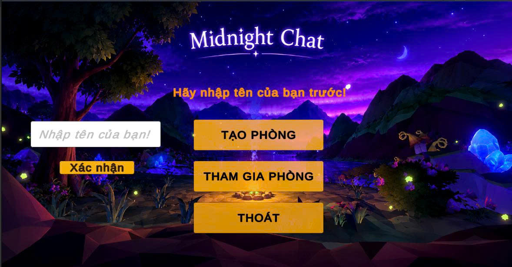
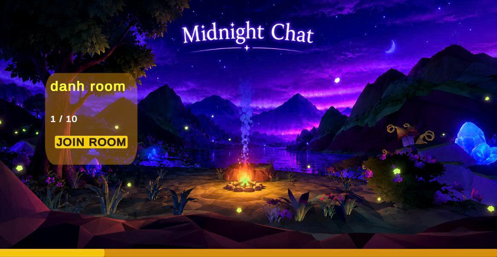
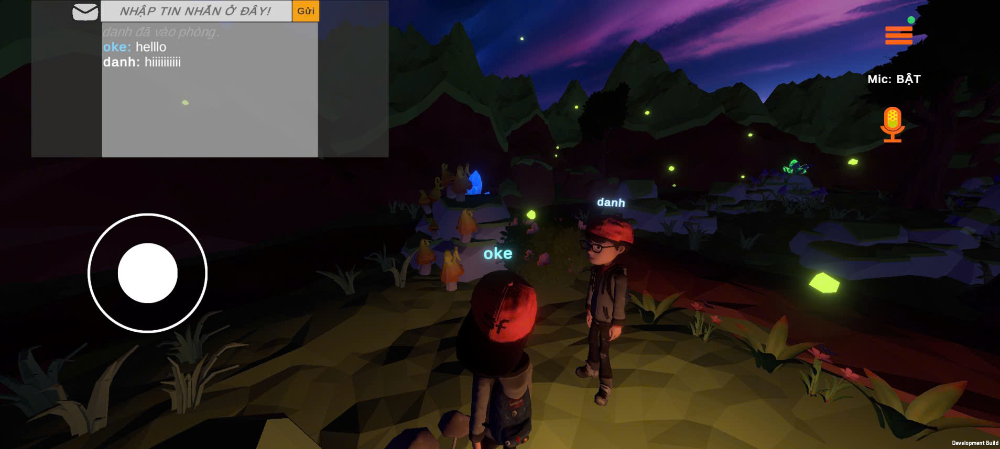
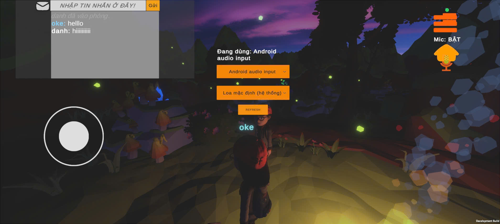
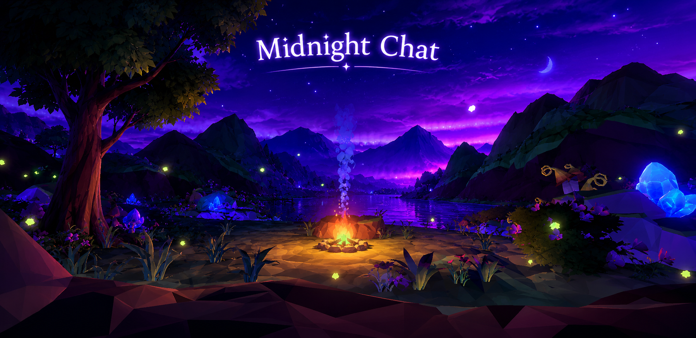
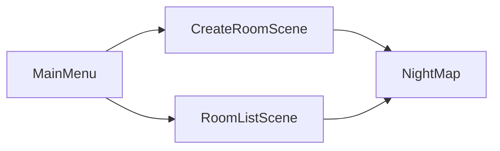

# MidnightChat

<div align="center">

<strong>Nighttime Chat and Exploration</strong> · Unity · Photon PUN · Voice & Chat · Mobile Multiplayer

<p>
  
  
  
  
  
</p>

</div>

---

## Introduction

**MidnightChat** is a 3D mobile multiplayer game where players can meet, chat, and explore the nighttime **NightMap** with friends. Players can set their name, create or join multiplayer rooms through Photon, use **voice chat** and **room chat**, and control their character using an on-screen joystick.

<table>
<tr>
<td width="50%" valign="top">

### Gameplay

* 3D movement with a joystick
* Third-person camera following the character
* Footstep sounds
* Stylized nighttime environment

</td>
<td width="50%" valign="top">

### Multiplayer

* Automatic Photon connection
* Create and join rooms with up to 10 players
* Real-time room list
* Scene synchronization between clients

</td>
</tr>
<tr>
<td width="50%" valign="top">

### Voice and Chat

* Voice chat through Photon Voice
* In-game volume and microphone settings
* Text chat inside rooms

</td>
<td width="50%" valign="top">

### Mobile

* Adaptive Performance for Samsung and Google devices
* Touch-optimized UI
* Landscape screen orientation

</td>
</tr>
</table>

---

## Screenshots

|                      Main Menu                     |                      Room List                     |
| :------------------------------------------------: | :------------------------------------------------: |
|  |  |

|                     Night Map Gameplay                    |                      Voice and Chat                      |
| :-------------------------------------------------------: | :------------------------------------------------------: |
|  |  |

### Banner

<p align="center">
  
</p>

## Demo Video

[](https://www.youtube.com/watch?v=DQCeELvtVCk)

Click the image above to watch the demo on YouTube.

---

## Scene Flow


```mermaid
flowchart LR
    A[MainMenu] --> B[CreateRoomScene]
    A --> C[RoomListScene]
    B --> D[NightMap]
    C --> D
```

| Scene             | Description                                                         |
| ----------------- | ------------------------------------------------------------------- |
| `MainMenu`        | Main menu, Photon connection, and player name setup                 |
| `CreateRoomScene` | Create a new multiplayer room                                       |
| `RoomListScene`   | View and join available rooms                                       |
| `NightMap`        | Main gameplay scene with player spawning, voice chat, and room chat |

---

## Technologies

| Component       | Details                                          |
| --------------- | ------------------------------------------------ |
| **Engine**      | Unity `2022.3.62f2`                              |
| **Template**    | Mobile 3D + Adaptive Performance                 |
| **Multiplayer** | Photon PUN 2                                     |
| **Voice**       | Photon Voice                                     |
| **UI**          | TextMesh Pro, UGUI                               |
| **Controls**    | Joystick Pack, First Person Controller (modular) |

---

## Project Structure

```text
MidnightChat/
├── Assets/
│   ├── Scenes/              # MainMenu, CreateRoom, RoomList, NightMap
│   ├── Script/
│   │   ├── Networking/      # Launcher, GameManager, room list, chat
│   │   ├── Player/          # Setup, name tag, footstep
│   │   ├── Voice/           # VoiceManager, PlayerVoice, settings UI
│   │   └── Camera/
│   └── Photon/               # PUN + Voice SDK
├── docs/
│   └── images/              # Screenshots
├── ProjectSettings/
└── README.md
```

---

## Installation and Setup

### Requirements

* [Unity Hub](https://unity.com/download) with **Unity 2022.3.62f2** or another compatible 2022.3 LTS version
* [Photon](https://www.photonengine.com/) account with a PUN App ID and Voice App ID if voice chat is enabled
* Android SDK / Xcode for mobile builds

### Setup

1. **Clone the repository:**

   ```bash
   git clone https://github.com/YOUR_USERNAME/MidnightChat.git
   cd MidnightChat
   ```

2. Open the project in **Unity Hub** → Add → select the `MidnightChat` folder.

3. Configure the **Photon App ID** in the Photon dashboard and assign it to `PhotonServerSettings` under `Assets/Photon/...`.

4. Open `Assets/Scenes/MainMenu.unity` and press **Play**, or build the project through **File → Build Settings** for Android or iOS.

### Mobile Build

1. Go to `File → Build Settings` and select **Android** or **iOS**.
2. Make sure all four scenes are included in **Scenes In Build**.
3. Open **Player Settings** and configure:

   * Company: `dankchan`
   * Product: `MidnightChat`

---

## Main Scripts

| Script                 | Role                                                                                                 |
| ---------------------- | ---------------------------------------------------------------------------------------------------- |
| `Launcher.cs`          | Photon singleton responsible for connection, lobby, room creation/joining, and scene synchronization |
| `GameManager.cs`       | Spawns the local player when entering `NightMap`                                                     |
| `CreateRoomManager.cs` | Handles room creation UI and logic                                                                   |
| `RoomListUI.cs`        | Displays the available room list                                                                     |
| `RoomChatManager.cs`   | Handles room text chat                                                                               |
| `VoiceManager.cs`      | Manages global voice functionality                                                                   |
| `PlayerVoice.cs`       | Handles voice functionality for individual players                                                   |

---

## Contributing

Pull requests and issues are welcome. Please provide a clear description of the bug or feature request, along with the relevant scene and reproduction steps when applicable.

---

<div align="center">

<p>
  Made with Unity · Photon · <strong>MidnightChat</strong>
</p>

<p>
  <sub>Repository: <code>MidnightChat</code> · Unity 2022.3 LTS</sub>
</p>

</div>
